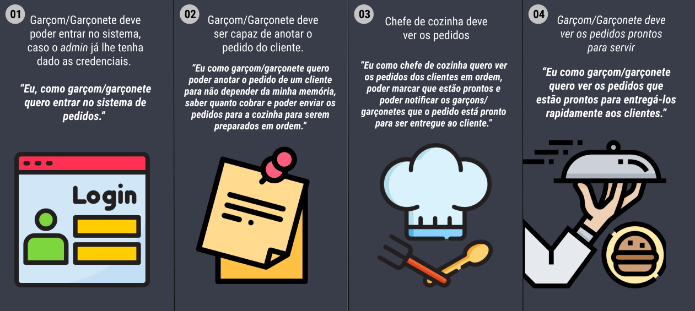

# Divino Burger :hamburger:

## Projeto 4 - Burger Queen desenvolvido no bootcamp de Front-End da SAP006 Laboratória :yellow_heart:

## Índice

1. [Definição do Produto](#dart-definição-do-produto)
2. [Histórias de Usuários](#pencil2-histórias-de-usuários)
3. [Protótipos](#art-protótipos)
4. [Como usar?](#gear-como-usar)
5. [Testes de Usabilidade](#busts_in_silhouette-testes-de-usabilidade)
6. [Tecnologias utilizadas](#robot-tecnologias-utilizadas)
7. [Estrutura dos Principais Arquivos](#file_folder-estrutura-dos-principais-arquivos)
8. [Resultados](#%EF%B8%8F-resultados)
9. [Sobre as desenvolvedoras](#woman_technologist-sobre-as-desenvolvedoras)

---
## :dart: Definição do Produto

Olá! Somos o [Divino Burger](https://divino-burger.vercel.app/), um fast food 24hrs. A nossa proposta de serviço 24 horas foi muito bem recebida e, para continuar a crescer, precisamos de um sistema que nos ajude a receber pedidos de nossos clientes.

Nós temos 2 menus. Um muito simples para o café da manhã:

| Item                           | Preço R$ |
| ------------------------------ | -------- |
| Café americano                 | 5        |
| Café com leite                 | 7        |
| Sanduíche de presunto e queijo | 10       |
| Suco de fruta natural          | 7        |

E outro menu para o resto do dia:

| Item                     | Preço  |
| ------------------------ | ------ |
| **Hambúrgueres**         | **R$** |
| Hambúrguer simples       | 10     |
| Hambúrguer duplo         | 15     |
| **Acompanhamentos**      | **R$** |
| Batata frita             | 5      |
| Anéis de cebola          | 5      |
| **Bebidas**              | **R$** |
| Água 500ml               | 5      |
| Água 750ml               | 7      |
| Bebida gaseificada 500ml | 7      |
| Bebida gaseificada 750ml | 10     |

**Importante:** Os clientes podem escolher entre hambúrgueres de carne bovina,
frango ou vegetariano. Além disso, por um adicional de R\$ 1,00 , eles podem
adicionar queijo **ou** ovo.

Nossos clientes são bastante indecisos, por isso é muito comum que eles mudem o
seu pedido várias vezes antes de finalizar.

A interface deve mostrar os dois menus (café da manhã e restante do dia), cada
um com todos os seus _produtos_. O usuário deve poder escolher que _produtos_
adicionar e a interface deve mostrar o _resumo do pedido_ com o custo total.

Além disso a cliente nos deu um [link da documentação](https://lab-api-bq.herokuapp.com/api-docs/)
que especifica o comportamento esperado da API que iremos expor por HTTP.
Lá podemos encontrar todos os detalhes dos _endpoints_, como por exemplo
que parâmetros esperam, o que devem responder, etc.

O objetivo principal é aprender a construir uma _interface web_ usando o
_framework_ escolhido (React). Esse framework front-end ataca
o seguinte problema: **como manter a interface e estado sincronizados**.
Portanto, esta experiência espera familiarizá-la com o conceito de _estado da
tela_, e como cada mudança no estado vai refletir na interface (por exemplo,
toda vez que adicionamos um _produto_ para um _pedido_, a interface deve
atualizar a lista de pedidos e o total).

---
## :pencil2: Histórias de Usuários


---
## :art: Protótipos 

* ####  Tablet


* #### Desktop


---
## :gear: Como usar?

- A tela inicial da aplicação traz a **Página de Login** que apresenta ao usário as opções de fazer o login com email e senha já cadastrados e entrar na plataforma do Divino Burger ou prosseguir para a Página de Cadastro;
- Na **Página de Cadastro**, o funcionário pode cadastrar-se inserindo seus dados de Nome, E-mail, Senha e Setor de Trabalho;
- Ao realizar qualquer uma dessas formas de acesso, o usuário será encaminhado para o seu respectivo ambiente:
    > **Salão**: para os garçons/garçonetes, onde ocorrerá a anotação e encaminhamento dos pedidos para a cozinha;
    > **Cozinha**: para os cozinheiros que receberão a demanda dos pedidos realizados.

---
## :busts_in_silhouette: Testes de Usabilidade
Durante o desenvolvimento do produto, foram realizados testes de usabilidade com diferentes indivíduos no intuito de analisar a experiência do usuário com a interface da aplicação. Com base nos resultados desse teste, foram detectados os seguintes pontos de ajustes:

- ...
- ...
- ...

Para a resolução dessas questões, foram implemantadas...

---
## :robot: Tecnologias 

| Ferramenta | Descrição |
| --- | --- |
| `React` | Uma biblioteca JavaScript para criar interfaces de usuário |
| `HTML 5` | Linguagem de marcação |
| `SCSS/SASS` | Linguagem de estilização |
| `JavaScript` |  Linguagem de programação interpretada estruturada |
| `Jest` | Framework de teste em JavaScript |
| `Node.js` | Software de execução de códigos JavaScript |
| `Git e GitHub` | Sistemas de controle de versões distribuídos |
| `Figma` | Editor gráfico de vetor e prototipagem de projetos |

---

## :file_folder: Estrutura dos Principais Arquivos
```
.
├── 📁public
|
├── 📁src
|   ├── 📁components
|   |   ├── 📁All-day
|   |   ├── 📁Breakfast
|   |   ├── 📁ButtonDefault
|   |   ├── 📁ButtonImg
|   |   ├── 📁ButtonRadio
|   |   ├── 📁ButtonSelect
|   |   ├── 📁CarArea
|   |   ├── 📁CartItem
|   |   ├── 📁DateTime
|   |   ├── 📁ErrorMessage
|   |   ├── 📁Header
|   |   ├── 📁Input
|   |   ├── 📁LinkAside
|   |   ├── 📁ListAllOrders
|   |   ├── 📁Loader
|   |   ├── 📁NotFound
|   |   ├── 📁OrdersPanel
|   |   ├── 📁Popup
|   |   ├── 📁PopupCancel
|   |   └── 📁ProductArea
|   |
|   ├── 📁img
|   |
|   ├── 📁pages
|   |   ├── 📁hall
|   |   ├── 📁HallOrders
|   |   ├── 📁Kitchen
|   |   ├── 📁Login
|   |   └── 📁Register
|   |
|   ├── 📁services
|   |   
|   ├── 📁utils
|   |
|   ├── 📄global.scss
|   ├── 📄index.js
|   └── 📄routes.js
|   
├── 📄README.md
└── 📄package.json

```

## ✔️ Resultados

* #### Tablet


* #### Desktop


---
## :woman_technologist: Sobre as desenvolvedoras

### Karen Freitas

- [LinkedIn](https://www.linkedin.com/in/karen-freitas/)
- E-mail: karenfcorrea@gmail.com
### Patrícia Barnabé

- [LinkedIn](https://www.linkedin.com/in/patriciabarnabe)
- E-mail: patbarnabe5@gmail.com

